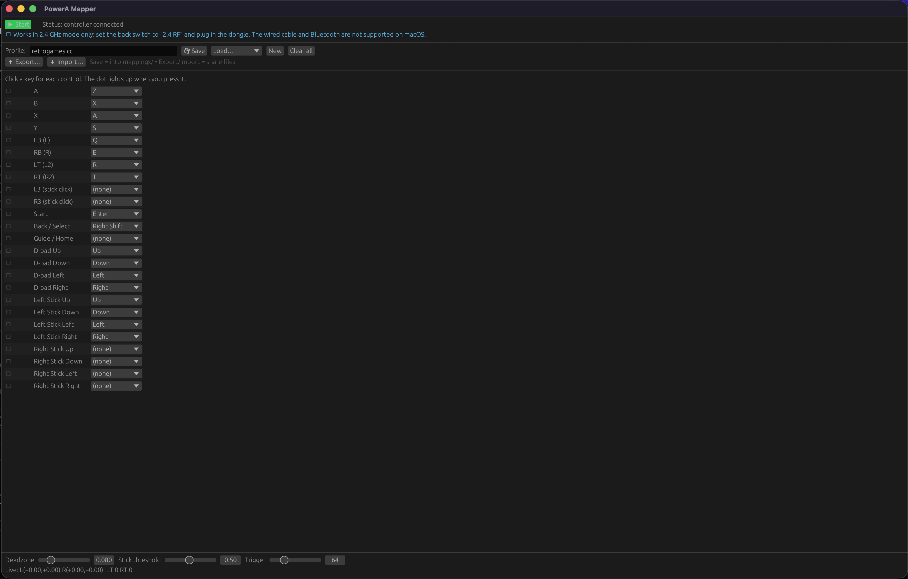

# powerA-controller-macos-mapper

A userspace macOS driver / input mapper for the **PowerA Battle Dragon Advanced
Wireless Controller for PC & Cloud Gaming** (`20D6:4024`), written in Rust.

It reads the controller over USB, decodes its buttons/sticks/triggers, and can
remap them to keyboard input so you can play games (e.g. arcade emulators like
retrogames.cc) — including a native macOS GUI for building, saving, and sharing
mappings.



> ⚠️ **Works in 2.4 GHz mode only.** Set the controller's back switch to
> **`2.4 RF`** and plug the bundled **2.4 GHz USB dongle** into the Mac. The
> wired USB cable and Bluetooth **do not work** for input on macOS (see
> [Why 2.4 GHz only](#why-24ghz-only)).

> 🌀 **This project is 100% vibe coded.** It was built end-to-end through an
> AI pair-programming session — hardware reverse-engineering, protocol
> decoding, and all the Rust — by vibes. Treat it accordingly. 🙂

---

## Requirements

- macOS (built/tested on Apple Silicon, macOS 26)
- **Rust** (stable) — install from <https://rustup.rs>
- The PowerA controller **+ its 2.4 GHz dongle**

## Install & run (personal / dev use)

There are **no prebuilt binaries** — you run it from source with Rust. (A
distributable, signed/notarized `.app` would require a paid Apple Developer
account, which this project intentionally doesn't use.)

```bash
# 1. install Rust
curl --proto '=https' --tlsv1.2 -sSf https://sh.rustup.rs | sh

# 2. get the code
git clone https://github.com/suhailmalik07/powerA-controller-macos-mapper.git && cd powerA-controller-macos-mapper

# 3. plug in the hardware (see below), then run the GUI mapper
make app          # = cargo run --release --bin app
```

Hardware setup:

1. Set the controller's **back switch to `2.4 RF`**.
2. Plug the **2.4 GHz dongle** into the Mac.
3. Power the controller on (LED steady).

> `cargo run` builds in debug; add `--release` for an optimized build
> (`cargo run --release --bin app`). The binary lives at
> `target/release/app` if you want to launch it directly.

## Binaries

```bash
# Identify HID devices / the controller
cargo run --bin enumerate

# Dump the controller's USB interfaces & endpoints
cargo run --bin usbprobe

# Live-print decoded input (sticks/triggers/buttons)
cargo run --bin powera

# CLI keyboard mapper (hardcoded retrogames.cc / Metal Slug layout)
cargo run --bin play

# Native GUI mapper — build/save/share mappings, live input, start/stop
cargo run --bin app
```

> Only **one** process can claim the controller at a time. Quit `powera`/`play`
> before launching `app`, and vice-versa.

## The mapper UI (`app`)

- **Live input** — each control's dot lights up when pressed.
- **Bind** a key to each control via the dropdowns.
- **Save** into the `mappings/` folder; **Load** any saved profile.
- **Export… / Import…** — share a mapping as a `.json` file with other people.
- **Tuning** — deadzone, stick threshold, trigger threshold.

### Accessibility permission

To actually send keystrokes, the app (or the terminal you run it from) must be
granted **System Settings → Privacy & Security → Accessibility**. The UI shows a
warning until this is done.

## Mappings

Profiles live in **`mappings/*.json`** and are human-readable, so they're easy
to hand-edit and share. Bundled:

- `mappings/default.json` — general starting template
- `mappings/retrogames.cc.json` — Metal Slug / retrogames.cc arcade layout

### JSON format

```json
{
  "name": "retrogames.cc",
  "deadzone": 0.08,
  "walk_threshold": 0.5,
  "trigger_threshold": 64,
  "bindings": {
    "A": "Z",
    "BACK": "Right Shift",
    "DPAD_UP": "Up"
  }
}
```

- `deadzone` (0.0–1.0): radial stick deadzone.
- `walk_threshold` (0.0–1.0): how far a stick must move before a `*_STICK_*`
  binding engages.
- `trigger_threshold` (0–255): how far a trigger must be pulled before `LT`/`RT`
  engages.
- `bindings`: a map of **control name → key name**. Omit a control to leave it
  unbound. Unknown key names are ignored on load (not fatal).

### Control names

```
A  B  X  Y                      face buttons
LB RB LT RT                     shoulders / triggers
L3 R3                           stick clicks
START  BACK  GUIDE              menu buttons (BACK = Select / "insert coin")
DPAD_UP DPAD_DOWN DPAD_LEFT DPAD_RIGHT
L_STICK_UP L_STICK_DOWN L_STICK_LEFT L_STICK_RIGHT
R_STICK_UP R_STICK_DOWN R_STICK_LEFT R_STICK_RIGHT
```

### Key names

Letters `A`–`Z`, digits `0`–`9`, `Up` `Down` `Left` `Right`, `Space` `Enter`
`Tab` `Escape` `Delete`, `Left Shift` `Right Shift`, `Left Ctrl` `Right Ctrl`,
`Left Option` `Right Option`, `Left Cmd` `Right Cmd`, and `, . / ; '`.

## Why 2.4 GHz only?

The controller reaches the Mac as a **vendor-specific XInput (Xbox 360
protocol)** interface — not a standard HID gamepad — so macOS doesn't recognize
it natively. We read it directly over libusb.

- **2.4 GHz dongle (`20D6:4024`)** ✅ — streams XInput reports; this driver reads
  it.
- **Wired USB cable (`20D6:4022`)** ❌ — the controller won't power into a
  streaming state over the cable on macOS (charges only).
- **Bluetooth** ❌ — pairing hangs in "connecting" on macOS (a known macOS
  Xbox-controller issue).

A *true* virtual gamepad (so games see a real Xbox pad via Apple's
GameController framework) would require a DriverKit system extension with the
restricted HID virtual-device entitlement — which needs a **paid** Apple
Developer account and Apple's approval. The keyboard-mapping approach here needs
none of that.

## How it works

- **Protocol:** Xbox 360 XInput. Interface class `0xFF/0x5D/0x01`, interrupt-IN
  endpoint `0x81`, 15-byte reports, no init handshake.
- **`src/lib.rs`** — report parser (`parse_report`/`GamepadState`), radial
  deadzone, and the USB `Controller` reader.
- **`src/mapping.rs`** — profile model, key table, JSON save/load/export/import,
  and the CGEvent key injector.
- **`src/bin/`** — the tools and the egui UI.

## License / disclaimer

Personal project, provided as-is. "PowerA" and "Xbox" are trademarks of their
respective owners; this project is not affiliated with or endorsed by them.
